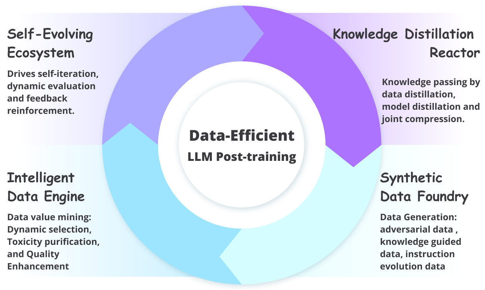

# 🚀 Awesome-Data-Efficient-LLM 🚀
A list of data-efficient and data-centric LLM (Large Language Model) papers

## ❖  Paper List

| Tilte | TLDR | Category | Paper Link | Year | Publish |
| --- | --- | --- | --- | --- | --- |
| Data-efficient Fine-tuning for LLM-based Recommendation | Propose data pruning method for efficient LLM - based recommendation. | Data Selection | [link](https://dl.acm.org/doi/pdf/10.1145/3626772.3657807?casa_token=yBnSImHcfyQAAAAA:eWCsuzaFE7kyRdOaAbg-bJKWyOVb_FAeWQAy1IhHgJkmO06ZunEZVBGvMAjpSoVIVEiYYXrHtY1h) | 2024 | ACM |
| CoachLM: Automatic Instruction Revisions Improve the Data Quality in LLM Instruction Tuning | CoachLM automatically revises samples to enhance instruction dataset quality. | Data Selection, Data Quality Enhancement | [link](https://arxiv.org/pdf/2311.13246) | 2023 | IEEE |
| Alpagasus:Training a Better Alpaca with Fewer Data | Propose data selection strategy, filter low - quality data for IFT, ALPAGASUS as example. | Data Selection | [link](https://www.researchgate.net/profile/Lichang-Chen-3/publication/372416306_AlpaGasus_Training_A_Better_Alpaca_with_Fewer_Data/links/65bf17811e1ec12eff71c20c/AlpaGasus-Training-A-Better-Alpaca-with-Fewer-Data.pdf) | 2024 | NIPS/ICML/ICLR |
| From Quantity to Quality: Boosting LLM Performance with Self-Guided  Data Selection for Instruction Tuning | Introduce self - guided method for LLMs to select samples, key innovation IFD metric. | Data Selection | [link](https://aclanthology.org/2024.naacl-long.421/) | 2024 | *ACL |
| Rethinking the Instruction Quality: LIFT is What You Need | LIFT elevates instruction quality by broadening data distribution. | Data Selection | [link](http://arxiv.org/pdf/2312.11508v2) | 2023 | arxiv |
| Instag:Instruction tagging for analyzing supervised fine-tuning of large language models.pdf | Propose INSTAG to tag instructions, find benefits for LLMs, and a data sampling procedure. | Data Selection | [link](https://openreview.net/pdf?id=wcSx5VjTPP) | 2024 | NIPS/ICML/ICLR |
| MoDS: Model-oriented Data Selection for Instruction Tuning | MoDS selects instruction data by quality, coverage and necessity. | Data Selection | [link](https://arxiv.org/pdf/2311.15653) | 2023 | arxiv |
| SELF-INSTRUCT: Aligning Language Models with Self-Generated Instructions | SELF - INSTRUCT bootstraps from LM for instruction - following, nearly annotation - free. | Data Selection | [link](https://aclanthology.org/2023.acl-long.754.pdf) | 2023 | *ACL |
| Active Instruction Tuning: Improving Cross-Task Generalization by Training on Prompt Sensitive Tasks | Propose active IT based on prompt uncertainty to select tasks for LLM tuning. | Data Selection | [link](https://aclanthology.org/2023.emnlp-main.112.pdf) | 2023 | *ACL |
| Automated Data Curation for Robust Language Model Fine-Tuning | Introduce CLEAR for data curation in LLM fine - tuning without extra computations. | Data Selection | [link](https://openreview.net/pdf?id=cd525xu7OM) | 2024 | *ACL |
| CLUES: Collaborative Private-domain High-quality Data Selection for LLMs via Training Dynamics | Propose data quality control via training dynamics for collaborative LLM training. | Data Selection | [link](https://openreview.net/pdf?id=OU1uqd1vyw) | 2024 | NIPS/ICML/ICLR |
| Compute-Constrained Data Selection | Formalize data selection problem cost - aware, model trade - offs. | Data Selection | [link](https://openreview.net/pdf?id=4es2oO9tw1) | 2025 | NIPS/ICML/ICLR |
| DATA ADVISOR: Dynamic Data Curation for Safety Alignment of Large Language Models | DATA ADVISOR for data generation to enhance LLM safety. | Data Selection | [link](https://aclanthology.org/2024.emnlp-main.461.pdf) | 2024 | *ACL |
| Data Curation Alone Can Stabilize In-context Learning | Two methods curate training data subsets to stabilize ICL without algorithm changes. | Data Selection | [link](https://aclanthology.org/2023.acl-long.452.pdf) | 2023 | *ACL |
| Get more for less: Principled Data Selection for Warming Up Fine-Tuning in LLMs | Select data to nudge pre - training dist. closer to target dist. for cost - effective fine - tuning. | Data Selection | [link](https://openreview.net/pdf?id=QmYNBVukex) | 2024 | NIPS/ICML/ICLR |
| Improving Data Efficiency via Curating LLM-Driven Rating Systems | DS2 corrects LLM - based scores for data selection promoting diversity. | Data Selection | [link](https://openreview.net/pdf?id=DKkQtRMowq) | 2025 | NIPS/ICML/ICLR |
| LLM-Select: Feature Selection with Large Language Models | LLMs can select predictive features without seeing training data. | Data Selection | [link](https://openreview.net/pdf?id=16f7ea1N3p) | 2024 | Journal |
| One-Shot Learning as Instruction Data Prospector for Large Language Models | NUGGETS uses one - shot learning to select high - quality instruction data. | Data Selection | [link](https://aclanthology.org/2024.acl-long.252.pdf) | 2024 | *ACL |
| SAMPLE-EFFICIENT ALIGNMENT FOR LLMS | Introduce unified algorithm for LLM alignment based on Thompson sampling. | Data Selection | [link](https://arxiv.org/abs/2410.06961) | 2024 | arxiv |
| LESS: Selecting Influential Data for Targeted Instruction Tuning | Propose LESS to select data for targeted instruction tuning in LLMs. | Data Selection | [link](https://arxiv.org/abs/2402.04333) | 2024 | NIPS/ICML/ICLR |
| An Experimental Design Framework for Label-Efficient Supervised Finetuning of Large Language Models | Propose experimental design for SFT in LLMs to mitigate annotation cost. | Data Selection | [link](https://aclanthology.org/2024.findings-acl.390/) | 2024 | *ACL |
| DELE: Data Efficient LLM Evaluation | Propose adaptive sampling for LLM evaluation to reduce cost without losing integrity. | Data Selection | [link](https://openreview.net/pdf?id=I8bsxPWLNF) | 2024 | NIPS/ICML/ICLR |
| Towards a Theoretical Understanding of Synthetic Data in LLM Post-Training: A Reverse-Bottleneck Perspective | Model synthetic data gen process, relate generalization & info gain. | Data Synthesis | [link](https://arxiv.org/pdf/2410.01720) | 2024 | arxiv |
| Advancing Theorem Proving in LLMs through Large-Scale Synthetic Data | Generate Lean 4 proof data to enhance LLM theorem - proving, without experimental focus. | Data Synthesis | [link](https://openreview.net/pdf?id=TPtXLihkny) | 2024 | NIPS/ICML/ICLR |
| Are LLMs Naturally Good at  Synthetic Tabular Data Generation? | LLMs as-is or fine - tuned are bad at tabular data generation; permutation - aware can help. | Data Synthesis | [link](https://arxiv.org/pdf/2406.14541) | 2024 | arxiv |
| Balancing Cost and Effectiveness of Synthetic Data Generation Strategies for LLMs | Group synthetic data strategies, study LLM training, propose selection framework. | Data Synthesis | [link](https://openreview.net/pdf?id=hRjFiTxv1v) | 2024 | NIPS/ICML/ICLR |
| Best Practices and Lessons Learned on  Synthetic Data for Language Models | The paper focuses on synthetic data for LMs, its use, challenges and responsible use. | Data Synthesis | [link](https://arxiv.org/pdf/2404.07503v1?trk=public_post_comment-text) | 2024 | arxiv |
| ChatTS: Aligning Time Series with LLMs via Synthetic Data for Enhanced Understanding and Reasoning | ChatTS, a TS - MLLM, uses synthetic data for time series analysis. | Data Synthesis | [link](https://arxiv.org/pdf/2412.03104) | 2024 | arxiv |
| Data extraction for evidence synthesis using a large language model: A proof-of-concept study | The study assesses Claude 2's data extraction in evidence synthesis. | Data Synthesis | [link](https://onlinelibrary.wiley.com/doi/pdf/10.1002/jrsm.1710) | 2024 | Journal |
| Illuminating Blind Spots of Language Models with Targeted Agent-in-the-Loop Synthetic Data | Use intelligent agents as teachers to generate samples for blind spot mitigation. | Data Synthesis | [link](https://export.arxiv.org/pdf/2403.17860v3.pdf) | 2024 | arxiv |
| Generating Faithful Synthetic Data with Large Language Models: A Case Study in Computational Social Science | The paper studies strategies to increase synthetic data faithfulness. | Data Synthesis | [link](https://arxiv.org/pdf/2305.15041) | 2023 | arxiv |
| Generative LLMs for Synthetic Data Generation: Methods, Challenges and the Future | The paper focuses on using LLMs for synthetic data generation & related aspects. | Data Synthesis | [link](https://arxiv.org/abs/2403.04190) | 2023 | Journal |
| HARMONIC: Harnessing LLMs for Tabular Data Synthesis and Privacy Protection | Introduce HARMONIC for tabular data synth & privacy, use LLMs w/ fine - tuning. | Data Synthesis | [link](https://openreview.net/pdf?id=hHA9qrGZBe) | 2024 | NIPS/ICML/ICLR |
| Magpie: Alignment Data Synthesis from Scratch by Prompting Aligned LLMs with Nothing | MAGPIE self - synthesizes alignment data from aligned LLMs without human prompts. | Data Synthesis | [link](https://openreview.net/pdf?id=Pnk7vMbznK) | 2024 | arxiv |
| Synthesizing Post-Training Data for LLMs through Multi-Agent Simulation | MATRIX multi - agent simulator creates scenarios for data synthesis in LLM post - training. | Data Synthesis | [link](https://openreview.net/pdf?id=o83aL1nZJd) | 2025 | NIPS/ICML/ICLR |
| Synthetic Data Generation with Large Language Models for Text  Classification: Potential and Limitations | Explore factors moderating LLM - generated data effectiveness in text classification. | Data Synthesis | [link](https://aclanthology.org/2023.emnlp-main.647.pdf) | 2023 | *ACL |
| Synthetic Oversampling: Theory and A Practical Approach Using LLMs to Address Data Imbalance | Develop theoretical foundations for synthetic oversampling using LLMs. | Data Synthesis | [link](https://arxiv.org/pdf/2406.03628) | 2024 | arxiv |
| Unveiling the Flaws: Exploring Imperfections in Synthetic Data and Mitigation Strategies for Large Language Models | This paper explores synthetic data flaws in LLM & presents a mitigation method. | Data Synthesis | [link](https://aclanthology.org/2024.findings-emnlp.873.pdf) | 2024 | *ACL |
| Condor: Enhance LLM Alignment with Knowledge-Driven Data Synthesis and Refinement | Condor generates high - quality SFT data with two - stage framework for LLMs. | Data Synthesis | [link](https://arxiv.org/pdf/2501.12273) | 2025 | arxiv |
| Data Augmentation using LLMs:  Data Perspectives, Learning Paradigms and Challenges | The paper explores LLM - based data augmentation, challenges & learning paradigms. | Data Augmentation | [link](https://aclanthology.org/2024.findings-acl.97.pdf) | 2024 | *ACL |
| Data is all you need: Finetuning LLMs for Chip Design via an Automated design-data augmentation framework | Propose an automated design - data augmentation framework for LLMs in chip design. | Data Augmentation | [link](https://dl.acm.org/doi/pdf/10.1145/3649329.3657356) | 2024 | ACM |
| LLM-powered Data Augmentation for Enhanced Cross-lingual Performance | Uses LLMs for data augmentation in limited multilingual datasets. | Data Augmentation, Survey | [link](https://arxiv.org/pdf/2305.14288) | 2023 | *ACL |
| LLM-DA: Data Augmentation via Large Language Models for Few-Shot Named Entity Recognition | LLM - DA augments data at context/entity levels for few - shot NER. | Data Augmentation | [link](https://arxiv.org/pdf/2402.14568) | 2024 | arxiv |
| LLM-Generated Natural Language Meets Scaling Laws: New Explorations and Data Augmentation Methods | Calculates LLMNL and HNL by scaling laws, proposes ZGPTDA for data augmentation. | Data Augmentation | [link](https://arxiv.org/pdf/2407.00322) | 2024 | arxiv |
| A Survey on Data Augmentation in Large Model Era | Paper reviews large - model - driven data aug. methods, applications & future challenges. | Data Augmentation | [link](https://arxiv.org/pdf/2401.15422) | 2024 | arxiv |
| ChatGPT Based Data Augmentation for Improved Parameter-Efficient Debiasing of LLMs | Use ChatGPT to generate data for LLM debiasing with two strategies. | Data Augmentation | [link](https://openreview.net/pdf?id=q5Ft9ZJtHm) | 2024 | COLM |
| A Guide To Effectively Leveraging LLMs for Low-Resource Text Summarization: Data Augmentation and Semi-supervised Approaches | Two new methods for low - resource text summarization are proposed. | Data Augmentation | [link](https://arxiv.org/pdf/2407.07341) | 2025 | *ACL |
| Empowering Large Language Models for Textual Data Augmentation | Propose a solution to auto - generate LLM augmentation instructions for quality data. | Data Augmentation | [link](https://aclanthology.org/2024.findings-acl.756.pdf) | 2024 | *ACL |
| LLM-Generated Natural Language Meets Scaling Laws: New Explorations and Data Augmentation Methods | Introduce scaling laws for LLMNL and HNL, a new data augmentation method ZGPTDA. | Data Augmentation | [link](https://arxiv.org/pdf/2407.00322) | 2024 | arxiv |
| LLM-AutoDA: Large Language Model-Driven Automatic Data Augmentation for Long-tailed Problems | Proposes LLM - AutoDA for long - tailed data augmentation by leveraging large - scale models. | Data Augmentation | [link](https://openreview.net/pdf?id=VpuOuZOVhP) | 2024 | NIPS/ICML/ICLR |
| Building a Family of Data Augmentation Models for Low-cost LLM Fine-tuning on the Cloud | Present data augmentation models for low - cost LLM fine - tuning with key functionalities. | Data Augmentation | [link](https://chywang.github.io/papers/coling2025.pdf) | 2025 | *ACL |
| Mini-DA: Improving Your Model Performance through Minimal Data Augmentation using LLM | Mini - DA selects challenging samples for augmentation, improving resource utilization. | Data Augmentation | [link](https://aclanthology.org/2024.dash-1.4.pdf) | 2024 | *ACL |
| Data Augmentation for Text-based Person Retrieval Using Large Language Models | Propose LLM - DA for TPR, use TFF & BSS to augment data concisely & efficiently. | Data Augmentation | [link](https://openreview.net/pdf?id=sdPeC6Oohf) | 2024 | *ACL |
| Data Augmentation for Cross-domain Parsing via Lightweight LLM Generation and Tree Hybridization  | Propose data augmentation via LLM & tree hybridization for cross - domain parsing. | Data Augmentation | [link](https://aclanthology.org/2025.coling-main.744.pdf) | 2025 | *ACL |
| AugGPT: Leveraging ChatGPT for Text Data Augmentation | Propose AugGPT for text data augmentation, rephrasing training samples. | Data Augmentation | [link](http://javascript:void()) | 2025 | IEEE |
| PGA-SciRE: Harnessing LLM on Data Augmentation for Enhancing Scientific Relation Extraction | Propose PGA framework for RE in scientific domain, two data aug. ways. | Data Augmentation | [link](https://arxiv.org/pdf/2405.20787) | 2024 | arxiv |
| Improving Topic Relevance Model by Mix-structured Summarization and LLM-based Data Augmentation | Use query/doc summaries & LLM data augmentation for topic relevance modeling. | Data Augmentation | [link](https://arxiv.org/pdf/2404.02616) | 2024 | arxiv |
| Retrieval-Augmented Data Augmentation for Low-Resource Domain Tasks | Propose RADA framework to augment data for low - resource domain tasks. | Data Augmentation | [link](https://arxiv.org/pdf/2402.13482) | 2024 | arxiv |
| The Applicability of LLMs in Generating Textual Samples for Analysis of Imbalanced Datasets | The paper compares approaches for handling text data class imbalance. | Data Augmentation | [link](https://ieeexplore.ieee.org/stamp/stamp.jsp?tp=&arnumber=10683735) | 2024 | IEEE |
| Self-Rewarding Language Models | Study self - rewarding LMs, use LLM - as - a - Judge for self - rewards during training. | Self Evolution | [link](https://openreview.net/pdf?id=0NphYCmgua) | 2024 | NIPS/ICML/ICLR |
| Self-Play Fine-Tuning Converts Weak Language Models to Strong Language  Models | Propose SPIN method for LLM, self - play mechanism refines its own capabilities. | Self Evolution | [link](https://arxiv.org/abs/2401.01335) | 2024 | NIPS/ICML/ICLR |
| Self-Boosting Large Language Models with Synthetic Preference Data | SynPO self - boosts LLMs via synthetic preference data, eliminating large - scale annotation. | Self Evolution | [link](https://arxiv.org/abs/2410.06961) | 2024 | arxiv |
| MEMORYLLM: Towards Self-Updatable Large Language Models | MEMORYLLM is self - updatable, can integrate new knowledge and retain long - term info. | Self Evolution | [link](https://arxiv.org/abs/2402.04624) | 2024 | NIPS/ICML/ICLR |
| Self-Refine: Iterative Refinement with Self-Feedback | Self - Refine iteratively refines LLM outputs without extra training data or RL. | Self Evolution | [link](https://openreview.net/forum?id=S37hOerQLB) | 2023 | NIPS/ICML/ICLR |
| META-REWARDING LANGUAGE MODELS: Self-Improving Alignment with LLM-as-a-Meta-Judge | Introduce Meta - Rewarding step for self - improving LLMs' judgment skills. | Self Evolution | [link](https://arxiv.org/pdf/2407.19594) | 2024 | arxiv |
| Automated Proof Generation for Rust Code via Self-Evolution | SAFE framework enables Rust code proof generation via self - evolving cycle. | Self Evolution | [link](https://openreview.net/pdf?id=2NqssmiXLu) | 2025 | NIPS/ICML/ICLR |
| Arxiv Copilot: A Self-Evolving and Efficient LLM System for Personalized Academic Assistance | Arxiv Copilot is a self - evolving LLM system for personalized academic assistance. | Self Evolution | [link](https://aclanthology.org/2024.emnlp-demo.13.pdf) | 2024 | *ACL |
| Automatic programming via large language models with population self-evolution for dynamic job shop scheduling problem | This paper proposes SeEvo method for HDRs design inspired by experts' strategies. | Self Evolution | [link](https://arxiv.org/pdf/2410.22657) | 2024 | arxiv |
| Benchmark Self-Evolving: A Multi-Agent Framework for Dynamic LLM Evaluation | A multi - agent framework for dynamic LLM evaluation through instance reframing. | Self Evolution | [link](https://aclanthology.org/2025.coling-main.223.pdf) | 2025 | *ACL |
| Bias Amplification in Language Model Evolution:  An Iterated Learning Perspective | Draws parallels between LLM behavior & human culture evolution via Iterated Learning. | Self Evolution | [link](https://openreview.net/pdf?id=BSYn7ah4KX) | 2024 | NIPS/ICML/ICLR |
| Enhanced Fine-Tuning of Lightweight  Domain-Specific Q&A Model Based on Large  Language Models | Propose Self - Evolution framework for lightweight LLM fine - tuning. | Self Evolution | [link](http://javascript:void()) | 2024 | IEEE |
| Interactive Evolution: A Neural-Symbolic  Self-Training Framework For Large Language Models | Propose ENVISIONS to self - train LLMs in neural - symbolic scenarios, overcoming two challenges. | Self Evolution | [link](https://arxiv.org/pdf/2406.11736) | 2024 | arxiv |
| I-SHEEP: Self-Alignment of LLM from Scratch through an Iterative Self-Enhancement Paradigm | I - SHEEP paradigm enables LLMs to self - improve iteratively in low - resource scenarios. | Self Evolution | [link](https://arxiv.org/pdf/2408.08072) | 2024 | arxiv |
| Language Models as Continuous Self-Evolving Data Engineers | Propose LANCE for LLMs to self - train by auto - data operations, reducing post - training cost. | Self Evolution | [link](https://arxiv.org/pdf/2412.15151) | 2024 | arxiv |
| LLM Guided Evolution - The Automation of Models Advancing  Models | GE uses LLMs to directly modify code for model evolution. | Self Evolution | [link](https://arxiv.org/pdf/2403.11446) | 2024 | arxiv |
| LLM-Evolve: Evaluation for LLM's Evolving Capability on Benchmarks | Proposes LLM - Evolve framework to evaluate LLMs' evolving ability on benchmarks. | Self Evolution | [link](https://aclanthology.org/2024.emnlp-main.940.pdf) | 2024 | *ACL |
| Long Term Memory : The Foundation of AI Self-Evolution | This paper explores AI self - evolution with LTM, not on experimental performance. | Self Evolution | [link](https://arxiv.org/pdf/2410.15665) | 2024 | arxiv |
| METEOR: Evolutionary Journey of Large Language Models from Guidance to Self-Growth | Propose Meteor method for model evolution with 3 training phases to maximize domain capabilities. | Self Evolution, Distillation | [link](https://arxiv.org/pdf/2411.11933) | 2024 | arxiv |
| Promptbreeder: Self-referential self-improvement via prompt evolution | Promptbreeder self - improves prompts via self - referential evolution. | Self Evolution | [link](https://openreview.net/pdf?id=9ZxnPZGmPU) | 2024 | NIPS/ICML/ICLR |
| rStar-Math: Small LLMs Can Master Math Reasoning with Self-Evolved Deep Thinking | rStar - Math uses deep thinking via MCTS for SLMs to master math reasoning. | Self Evolution | [link](https://arxiv.org/pdf/2501.04519) | 2025 | arxiv |
| Self: Language-driven self-evolution for large language model | SELF enables LLMs to self - evolve without human intervention via language feedback. | Self Evolution | [link](https://openreview.net/pdf?id=XD0PHQ5ry4) | 2024 | NIPS/ICML/ICLR |
| Self-Evolution Fine-Tuning for Policy Optimization | SEFT for policy optimization eliminates need for annotated samples. | Self Evolution | [link](https://aclanthology.org/2024.findings-emnlp.238.pdf) | 2024 | *ACL |
| Self-Evolutionary Group-wise Log Parsing Based on Large Language Model | SelfLog self - evolves by LLM - extracted similar pairs and uses N - Gram - based methods. | Self Evolution | [link](http://javascript:void()) | 2024 | IEEE |
| Self-Evolutionary Large Language Models through Uncertainty-Enhanced  Preference Optimization | UPO framework mitigates noisy pref data for LLM self - evolution via reliable feedback. | Self Evolution | [link](https://arxiv.org/pdf/2409.11212) | 2024 | arxiv |
| Self-Evolved Reward Learning for LLMs | Self - Evolved Reward Learning (SER) iteratively improves RM with self - generated data. | Self Evolution | [link](https://arxiv.org/pdf/2411.00418) | 2025 | NIPS/ICML/ICLR |
| AugmenToxic: Leveraging Reinforcement Learning to Optimize LLM  Instruction Fine-Tuning for Data Augmentation to Enhance Toxicity  Detection | Propose RL - based method for LLM fine - tuning to augment toxic language data. | Toxicity / Trust-worthy | [link](https://dl.acm.org/doi/pdf/10.1145/3700791) | 2024 | ACM |
| Benchmarking LLMs in Political Content Text-Annotation:  Proof-of-Concept with Toxicity and Incivility Data | Benchmarked LLMs in political text -annotation, not focusing on exp. performance. | Toxicity / Trust-worthy | [link](https://arxiv.org/pdf/2409.09741) | 2024 | arxiv |
| Can LLMs Recognize Toxicity? A Structured Investigation Framework and  Toxicity Metric | Introduce LLM - based toxicity metric, analyze factors, evaluate its performance. | Toxicity / Trust-worthy | [link](https://aclanthology.org/2024.findings-emnlp.353.pdf) | 2024 | *ACL |
| Characterizing Large Language Model Geometry Helps Solve Toxicity Detection and Generation | The paper uses geometry to understand LLMs and solve toxicity - related issues. | Toxicity / Trust-worthy | [link](https://openreview.net/pdf?id=glfcwSsks8) | 2024 | NIPS/ICML/ICLR |
| Detectors for Safe and Reliable LLMs:  Implementations, Uses, and Limitations | Paper presents detectors library for LLM harms, uses & challenges, not exp perf. | Toxicity / Trust-worthy | [link](https://arxiv.org/pdf/2403.06009) | 2024 | arxiv |
| Do-Not-Answer: A Dataset for Evaluating Safeguards in LLMs | This paper creates an open - source dataset to evaluate LLM safeguards. | Toxicity / Trust-worthy | [link](https://arxiv.org/pdf/2308.13387) | 2023 | arxiv |
| Effcient Toxic Content Detection by Bootstrapping and Distilling  Large Language Models | BD - LLM bootstraps & distills LLMs for toxic content detection via DToT. | Toxicity / Trust-worthy | [link](https://ojs.aaai.org/index.php/AAAI/article/view/30178/32091) | 2024 | AAAI/IJCAL |
| Evaluating the Impact of Model Size on Toxicity and Stereotyping in Generative LLM | Explore LLM size's relation to toxicity & stereotyping, smallest model performs best. | Toxicity / Trust-worthy | [link](https://search.proquest.com/openview/f507a0708ada710bf837fb09cbeacce6/1?pq-origsite=gscholar&cbl=18750&diss=y&casa_token=y3IMfUXgc-cAAAAA:TLZXqHQgYDujH6JiOoTSw2cJD9aQtgsQnmVSRY2fBRmEqCr9DQZUjdOyC3rvMdJQ9oX5PFF57w) | 2023 | Journal |
| How Toxic Can You Get? Search-based  Toxicity Testing for Large Language Models | EvoTox tests LLM toxicity post - alignment via iterative evolution strategy. | Toxicity / Trust-worthy | [link](https://arxiv.org/pdf/2501.01741) | 2025 | arxiv |
| Improving Covert Toxicity Detection  by Retrieving and Generating References | This paper explores refs' potential for covert toxicity detection. | Toxicity / Trust-worthy | [link](https://aclanthology.org/2024.woah-1.21.pdf) | 2024 | *ACL |
| Leak, Cheat, Repeat: Data Contamination  and Evaluation Malpractices in Closed-Source LLMs | The paper analyzes data contamination & eval malpractices in closed - source LLMs. | Toxicity / Trust-worthy | [link](https://openreview.net/pdf?id=exbPWKOyzF) | 2024 | *ACL |
| LLM-Based Synthetic Datasets:  Applications and Limitations in Toxicity Detection | The paper explores LLM - based synthetic data in toxicity detection, its potential and limits. | Toxicity / Trust-worthy | [link](https://aclanthology.org/2024.trac-1.pdf#page=49) | 2024 | *ACL |
| Mitigating Biases to Embrace Diversity: A Comprehensive Annotation  Benchmark for Toxic Language | New annotation benchmark reduces bias, shows LLM annotation value. | Toxicity / Trust-worthy | [link](https://aclanthology.org/2024.nlp4dh-1.36.pdf) | 2024 | *ACL |
| People Make Better Edits: Measuring the Efficacy of LLM-Generated  Counterfactually Augmented Data for Harmful Language Detection | Assess if CAD generation for harmful lang. detection can be automated using NLP models. | Toxicity / Trust-worthy | [link](https://aclanthology.org/2023.emnlp-main.649.pdf) | 2023 | *ACL |
| Realistic Evaluation of Toxicity in Large Language Models | New TET dataset helps rigorously evaluate toxicity in popular LLMs. | Toxicity / Trust-worthy | [link](https://aclanthology.org/2024.findings-acl.61.pdf) | 2024 | *ACL |
| TOXICCHAT: Unveiling Hidden Challenges of Toxicity Detection in  Real-World User-AI Conversation | This paper isn't about Efficient LLM Post Training, so can't provide relevant summary. | Toxicity / Trust-worthy | [link](https://aclanthology.org/2023.findings-emnlp.311.pdf) | 2023 | *ACL |
| Toxicity Detection with Generative Prompt-based Inference | Explore generative zero - shot prompt - based toxicity detection. | Toxicity / Trust-worthy | [link](https://arxiv.org/pdf/2205.12390) | 2022 | arxiv |
| Toxicity in CHATGPT:  Analyzing Persona-assigned Language Models | The paper evaluates ChatGPT toxicity based on persona - assigned language models. | Toxicity / Trust-worthy | [link](https://aclanthology.org/2023.findings-emnlp.88.pdf) | 2023 | *ACL |
| ToxiCraft:A Novel Framework for Synthetic Generation of Harmful Information | The paper proposes ToxiCraft to generate harmful info datasets, addressing two issues. | Toxicity / Trust-worthy | [link](https://aclanthology.org/2024.findings-emnlp.970.pdf) | 2024 | *ACL |
| TOXIGEN: A Large-Scale Machine-Generated Dataset for Adversarial  and Implicit Hate Speech Detection | Create TOXIGEN dataset, new method for generating text, human evaluation. | Toxicity / Trust-worthy | [link](https://arxiv.org/pdf/2203.09509) | 2022 | arxiv |
| Dialectal Toxicity Detection: Evaluating LLM-as-a-Judge Consistency  Across Language Varieties | This paper focuses on dialectal toxicity detection in LLMs, not relevant to efficient post - training. | Toxicity / Trust-worthy, LLM-as-Judger | [link](https://arxiv.org/pdf/2411.10954) | 2024 | arxiv |
| Do-Not-Answer: Evaluating Safeguards in LLMs | The paper curates a dataset to evaluate LLM safeguards for safer deployment. | Toxicity / Trust-worthy | [link](https://aclanthology.org/2024.findings-eacl.61.pdf) | 2024 | *ACL |
| An Empirical Study of LLM-as-a-Judge for LLM Evaluation: Fine-tuned  Judge Model is not a General Substitute for GPT-4 | Fine - tuned judge models have limitations, integrated method improves them. | LLM-as-Judger | [link](https://openreview.net/pdf?id=NmqJktMdtD) | 2024 | *ACL |
| CalibraEval: Calibrating Prediction Distribution to Mitigate Selection Bias in LLMs-as-Judges | CalibraEval mitigates LLM - as - Judges selection bias via NOA. | LLM-as-Judger | [link](https://arxiv.org/pdf/2410.15393) | 2024 | arxiv |
| Can LLMs be Good Graph Judger for Knowledge Graph Construction? | The paper proposes GraphJudger to address KG construction challenges. | LLM-as-Judger | [link](https://arxiv.org/pdf/2411.17388?) | 2024 | arxiv |
| CodeUltraFeedback: An LLM-as-a-Judge Dataset for Aligning Large Language Models to Coding Preferences | Propose LLM - as - a - Judge methodology for evaluating LLM coding preference alignment. | LLM-as-Judger | [link](https://arxiv.org/pdf/2403.09032) | 2024 | arxiv |
| Crowd score: A method for the evaluation of jokes using large language model AI voters as judges | Crowd Score method assesses joke funniness via LLMs as AI judges. | LLM-as-Judger | [link](https://arxiv.org/pdf/2212.11214) | 2022 | arxiv |
| Foundational Autoraters:  Taming Large Language Models for  Better Automatic Evaluation | Introduce FLAMe, trained on quality tasks, less biased than other LLM - as - a - Judge models. | LLM-as-Judger | [link](https://aclanthology.org/2024.emnlp-main.949.pdf) | 2024 | *ACL |
| Judging LLM-as-a-Judge with MT-Bench and Chatbot Arena | Use LLM - as - a - judge to evaluate chat assistants, verify with two benchmarks. | LLM-as-Judger | [link](https://proceedings.neurips.cc/paper_files/paper/2023/file/91f18a1287b398d378ef22505bf41832-Paper-Datasets_and_Benchmarks.pdf) | 2023 | NIPS/ICML/ICLR |
| Judgelm: Fine-tuned large language models are scalable judges | Fine - tune LLMs as scalable judges, propose dataset & techniques. | LLM-as-Judger | [link](https://openreview.net/pdf?id=87YOFayjcG) | 2023 | arxiv |
| Judging the Judges: Evaluating Alignment and Vulnerabilities in LLMs-as-Judges | The paper studies LLM - as - judges, judges' performance and vulnerabilities. | LLM-as-Judger | [link](https://arxiv.org/pdf/2406.12624) | 2024 | arxiv |
| Large Language Models are Inconsistent and Biased Evaluators | LLMs are inconsistent/biased evaluators; recipes to mitigate limitations are shared. | LLM-as-Judger | [link](http://arxiv.org/pdf/2405.01724v1) | 2024 | arxiv |
| Llm-as-a-judge & reward model- What they can and cannot do | Analysis of automated evaluators: English eval & limitations. | LLM-as-Judger | [link](https://arxiv.org/pdf/2409.11239) | 2024 | arxiv |
| LLMs instead of Human Judges?  A Large Scale Empirical Study across 20 NLP Evaluation Tasks | Evaluated 11 LLMs on 20 datasets; LLMs need human - validation before use as evaluators. | LLM-as-Judger | [link](https://arxiv.org/pdf/2406.18403?) | 2024 | arxiv |
| Meta-rewarding language models: Self-improving alignment with llm-as-a-meta-judge | Introduce Meta - Rewarding step to self - improve LLM's judgment skills. | LLM-as-Judger | [link](https://www.rivista.ai/wp-content/uploads/2024/10/2407.19594v2.pdf) | 2024 | arxiv |
| MLLM-as-a-Judge: Assessing Multimodal LLM-as-a-Judge with Vision-Language Benchmark | This paper introduces MLLM - as - a - Judge benchmark to assess MLLMs' judging ability. | LLM-as-Judger | [link](https://openreview.net/pdf/7b79429056d9d05232854cd6819ad0eef053ec70.pdf) | 2024 | NIPS/ICML/ICLR |
| R-Judge: Benchmarking Safety Risk Awareness for LLM Agents | R - Judge benchmarks LLM agents' safety risk awareness in interactions. | LLM-as-Judger | [link](https://openreview.net/pdf?id=zt78MtOz605) | 2024 | arxiv |
| Self-Taught Evaluators | An approach improves evaluators using only synthetic training data. | LLM-as-Judger | [link](https://arxiv.org/pdf/2408.02666) | 2024 | arxiv |
| Style Over Substance: Evaluation Biases for Large Language Models | Study shows evaluation bias for LLMs, proposes MERS to improve LLM - based evaluations. | LLM-as-Judger | [link](https://aclanthology.org/2025.coling-main.21.pdf) | 2025 | *ACL |
| Wider and Deeper LLM Networks  are Fairer LLM Evaluators | The paper uses wider & deeper LLM networks for fairer LLM evaluation. | LLM-as-Judger | [link](https://arxiv.org/pdf/2308.01862) | 2023 | arxiv |
| Internal Consistency and Self-Feedback in  Large Language Models: A Survey | This paper uses internal consistency perspective to explain LLM issues and introduce Self - Feedback. | Survey | [link](https://arxiv.org/abs/2407.14507) | 2024 | arxiv |
| A Survey on Self-Evolution of Large Language Models | The paper surveys self - evolution in LLMs, including its process and challenges. | Survey, Self Evolution | [link](https://arxiv.org/abs/2404.14387) | 2024 | arxiv |
| Automatically Correcting Large Language Models: Surveying the Landscape of Diverse Automated Correction Strategies | Reviews advances in auto - correcting LLMs via feedback, categorizes approaches. | Survey | [link](https://aclanthology.org/2024.tacl-1.27/) | 2024 | Journal |
| A Survey on Data Selection for LLM Instruction Tuning | This paper surveys data selection for LLM instruction tuning. | Survey, Data Selection | [link](https://arxiv.org/pdf/2402.05123) | 2024 | arxiv |
| Large Language Models for Data Annotation and Synthesis: A Survey | This paper focuses on LLM post - training from a data - centric view. | Survey, Data Synthesis | [link](https://aclanthology.org/2024.emnlp-main.54.pdf) | 2024 | *ACL |
| On LLMs-Driven Synthetic Data Generation, Curation,  and Evaluation: A Survey | The paper organizes LLMs - driven data gen. studies to show research gaps and future ways. | Survey | [link](https://aclanthology.org/2024.findings-acl.658.pdf) | 2024 | *ACL |
| Trustworthy LLMs： A survey and guideline for evaluating large language models' alignment | The paper surveys LLM trustworthiness dimensions for alignment evaluation. | Survey, Toxicity / Trust-worthy | [link](https://openreview.net/pdf?id=oss9uaPFfB) | 2024 | NIPS/ICML/ICLR |
| A Survey on Data Selection for Language Models | Comprehensive review of data selection for LMs to accelerate related research. | Survey, Data Selection | [link](https://openreview.net/pdf?id=XfHWcNTSHp) | 2024 | Journal |
| LLMs-as-Judges: A Comprehensive Survey on LLM-based Evaluation Methods | I'm sorry, but the given data is about "LLMs - as - Judges" not "Efficient LLM Post Training: A Data - centric Perspective", so I can't provide a relevant summary. | Survey, LLM-as-Judger | [link](https://arxiv.org/pdf/2412.05579) | 2024 | arxiv |
| A Survey on Data Synthesis and Augmentation for Large  Language Models | Reviews LLM data generation techniques, discusses constraints. | Survey, Data Synthesis, Data Augmentation | [link](https://arxiv.org/pdf/2410.12896) | 2024 | arxiv |
| A Survey on Knowledge Distillation of Large Language Models | Comprehensive survey on KD in LLMs: mechanisms, skills, verticalization & DA interplay. | Survey, Distillation | [link](https://arxiv.org/pdf/2402.13116) | 2024 | arxiv |
| Survey on Knowledge Distillation for Large Language Models: Methods, Evaluation, and Application  | Survey on LLM knowledge distillation methods, evaluation & application, not exp perf. | Survey, Distillation | [link](https://dl.acm.org/doi/pdf/10.1145/3699518) | 2024 | ACM |
| Impossible Distillation: from Low-Quality Model to High-Quality Dataset & Model for Summarization and Paraphrasing | Impossible Distillation: distill high - quality from low - quality for summarization & paraphrasing. | Distillation | [link](https://arxiv.org/pdf/2305.16635) | 2023 | arxiv |
| Prompt Distillation for Efficient LLM-based Recommendation | Propose prompt distillation to bridge IDs & words & reduce inference time. | Distillation | [link](https://dl.acm.org/doi/pdf/10.1145/3583780.3615017) | 2023 | ACM |
| Performance-Guided LLM Knowledge Distillation for Efficient Text Classification at Scale | PGKD for text classification, an LLM distillation method with versatile framework. | Distillation | [link](https://arxiv.org/pdf/2411.05045) | 2024 | *ACL |
| Knowledge Distillation in Automated Annotation: Supervised Text Classification with LLM-Generated Training Labels | The paper tests LLM - generated labels for supervised text classification workflows. | Distillation | [link](https://arxiv.org/pdf/2406.17633) | 2024 | *ACL |
| Multistage Collaborative Knowledge Distillation from a Large Language Model for Semi-Supervised Sequence Generation | Propose MCKD for semi - supervised seq. gen., iteratively improve pseudolabels. | Distillation | [link](https://aclanthology.org/2024.acl-long.766.pdf) | 2024 | *ACL |
| Self-Data Distillation for Recovering Quality in Pruned Large Language Models | Self - data distillation fine - tuning mitigates quality loss from pruning and SFT. | Distillation | [link](https://arxiv.org/pdf/2410.09982) | 2024 | NIPS/ICML/ICLR |
| Distillation Matters: Empowering Sequential Recommenders to Match the Performance of Large Language Models | Proposes DLLM2Rec for LLM-based rec. model distillation to sequential models. | Distillation | [link](https://dl.acm.org/doi/pdf/10.1145/3640457.3688118) | 2024 | ACM |
| Towards Cross-Tokenizer Distillation: the Universal Logit Distillation Loss for LLMs | Introduce ULD loss for cross - tokenizer distillation in LLMs. | Distillation | [link](https://openreview.net/pdf?id=bwRxXiGO9A) | 2025 | Journal |
| Self-Evolution Knowledge Distillation for LLM-based Machine Translation | Self - Evolution KD dynamically integrates prior knowledge for better knowledge transfer. | Distillation, Self Evolution | [link](https://arxiv.org/pdf/2412.15303) | 2025 | *ACL |
| Efficiently Distilling LLMs for Edge Applications | Propose MLFS for parameter - efficient supernet training of LLMs. | Distillation | [link](https://aclanthology.org/2024.naacl-industry.5.pdf) | 2024 | *ACL |
| Xai-driven knowledge distillation of large language models for efficient deployment on low-resource devices | DiXtill uses XAI to distill LLM knowledge into a self - explainable student model. | Distillation | [link](https://link.springer.com/content/pdf/10.1186/s40537-024-00928-3.pdf) | 2024 | Journal |
| Compact Language Models via Pruning and Knowledge Distillation | Develop compression practices for LLMs via pruning and distillation. | Distillation | [link](https://openreview.net/pdf?id=9U0nLnNMJ7) | 2024 | NIPS/ICML/ICLR |
| LLM-Enhanced Multi-Teacher Knowledge Distillation for Modality-Incomplete Emotion Recognition in Daily Healthcare | Propose LLM - enhanced multi - teacher KD for emotion rec in modality - incomplete cases. | Distillation | [link](http://javascript:void()) | 2024 | IEEE |
| BitDistiller: Unleashing the Potential of Sub-4-Bit LLMs via Self-Distillation | BitDistiller combines QAT and KD for sub - 4 - bit LLMs with new techniques. | Distillation | [link](https://aclanthology.org/2024.acl-long.7.pdf) | 2024 | *ACL |
| Reducing LLM Hallucination Using Knowledge Distillation: A Case Study with Mistral Large and MMLU Benchmark | Knowledge distillation reduces LLM hallucination via specific methods. | Distillation | [link](https://www.techrxiv.org/doi/pdf/10.36227/techrxiv.171665607.76504195/v1) | 2024 | arxiv |
| Distilling Large Language Models for Text-Attributed Graph Learning | Propose distilling LLMs into local graph model for TAG learning, novel training method. | Distillation | [link](https://dl.acm.org/doi/pdf/10.1145/3627673.3679830) | 2024 | ACM |
| CourseGPT-zh: an Educational Large Language Model Based on Knowledge Distillation Incorporating Prompt Optimization | CourseGPT - zh uses prompt optimization in a distillation framework for educational LLM. | Distillation | [link](https://arxiv.org/pdf/2405.04781) | 2024 | arxiv |
| LLMLingua-2: Data Distillation for Efficient and Faithful Task-Agnostic Prompt Compression | Propose data distillation for prompt compression, formulate as token classification. | Distillation | [link](https://aclanthology.org/2024.findings-acl.57.pdf) | 2024 | *ACL |
| LLM for Patient-Trial Matching: Privacy-Aware Data Augmentation Towards Better Performance and Generalizability | Propose LLM - PTM for patient - trial match, ensure data privacy in methodology. | Applications | [link](https://par.nsf.gov/servlets/purl/10448809) | 2023 | Others |
| LLM-Assisted Data Augmentation for Chinese Dialogue-Level Dependency Parsing | Present 3 LLM - based strategies for Chinese dialogue - level dependency parsing. | Applications | [link](https://direct.mit.edu/coli/article-pdf/doi/10.1162/coli_a_00515/2348416/coli_a_00515.pdf) | 2024 | Others |
| Resolving the Imbalance Issue in Hierarchical Disciplinary Topic Inference via LLM-based Data Augmentation | Use Llama V1 to augment data for balancing disciplinary topic inference. | Applications | [link](https://ieeexplore.ieee.org/stamp/stamp.jsp?tp=&arnumber=10411643) | 2023 | IEEE |
| LLM-based Privacy Data Augmentation Guided by Knowledge Distillation with a Distribution Tutor for Medical Text Classification | Propose a DP - based DA method for text classification in private domains. | Applications | [link](https://arxiv.org/pdf/2402.16515) | 2024 | Others |
| Large Language Models for Healthcare Data Augmentation: An Example on Patient-Trial Matching | An LLM - based patient - trial matching approach with privacy - aware data augmentation. | Applications | [link](https://pmc.ncbi.nlm.nih.gov/articles/PMC10785941/pdf/1147.pdf) | 2024 | Others |
| Identifying Citizen-Related Issues from Social Media Using LLM-Based Data Augmentation | Propose LLM - based method for data augmentation to extract citizen - related data from tweets. | Applications, Data Augmentation | [link](https://link.springer.com/chapter/10.1007/978-3-031-61057-8_31) | 2024 | Others |
| Synthetic Data Augmentation Using Large Language Models (LLM): A Case-Study of the Kamyr Digester | Introduces LLM - based data augmentation technique for data scarcity. | Applications | [link](http://javascript:void()) | 2024 | IEEE |
| Conditional Label Smoothing For LLM-Based Data Augmentation in Medical Text Classification | Propose CLS for data augmentation in medical text classification. | Applications | [link](http://javascript:void()) | 2024 | IEEE |
| Curriculum-style Data Augmentation for LLM-based Metaphor Detection | Propose open - source LLM fine - tuning and CDA for metaphor detection. | Applications, Data Augmentation | [link](https://arxiv.org/pdf/2412.02956) | 2024 | arxiv |
| Enhancing Speech De-Identification with LLM-Based Data Augmentation | A novel data augmentation method for speech de - id using LLM and end - to - end model. | Applications | [link](http://javascript:void()) | 2024 | IEEE |
| Enhancing Multilingual Fake News Detection through LLM-Based Data Augmentation | Use Llama 3 via LLM - based data augmentation to enrich fake news datasets. | Applications | [link](https://hal.science/hal-04733161/document) | 2024 | Others |
| LLMs Accelerate Annotation for Medical Information Extraction | Propose LLM - human combo for medical text annotation, reducing human burden. | Applications, Active Annotation | [link](https://proceedings.mlr.press/v225/goel23a/goel23a.pdf) | 2023 | Others |
| Crowdsourcing with Enhanced Data Quality Assurance: An Efficient Approach to Mitigate Resource Scarcity Challenges in Training Large Language Models for Healthcare | Propose CS framework with quality control for LLM in healthcare, address resource scarcity. | Applications | [link](https://pmc.ncbi.nlm.nih.gov/articles/PMC11141838/pdf/2418.pdf) | 2024 | Others |
| LLM2LLM: Boosting LLMs with Novel Iterative Data Enhancement | LLM2LLM iteratively augments data for LLM fine - tuning in low - data scenarios. | Data Quality Enhancement, Data Augmentation | [link](https://arxiv.org/pdf/2403.15042) | 2024 | *ACL |
| Data Quality Enhancement on the Basis of Diversity with Large Language Models for Text Classification: Uncovered, Difficult, and Noisy | Propose DQE method for text classification with LLMs, select data by greedy algorithm. | Data Quality Enhancement | [link](https://aclanthology.org/2025.coling-main.315.pdf) | 2025 | *ACL |
| Multi-News+: Cost-efficient Dataset Cleansing via LLM-based Data Annotation | Use LLM for data cleansing in Multi - News dataset, no need for costly human annotators. | Data Quality Enhancement | [link](https://aclanthology.org/2024.emnlp-main.2.pdf) | 2024 | *ACL |
| LLM-Enhanced Data Management | LLMDB for data management: avoid hallucination, reduce cost, improve accuracy. | Data Quality Enhancement | [link](https://scholar.google.com/scholar_url?url=https://dl.acm.org/doi/pdf/10.14778/3685800.3685838%3Fcasa_token%3DRMVy-w25l38AAAAA:yn4hHsCOdVNfvCfv3LTy3eSrygxKhbjjVJHJA5PoYDD1vUfujE-pbQPmlEuY5Bb_ERqunv3Ok8WI&hl=zh-CN&sa=T&oi=ucasa&ct=ucasa&ei=XOSlZ7_jK_imieoPuuv_sAc&scisig=AFWwaeZJEXSXgDXztN3ukyA9rymL) | 2024 | ACM |
| Enhancing LLM Fine-tuning for Text-to-SQLs by SQL Quality Measurement | Propose using SQL Quality Measurement to enhance LLM-based Text - to - SQLs performance. | Data Quality Enhancement | [link](https://arxiv.org/pdf/2410.01869) | 2024 | arxiv |
| On The Role of Prompt Construction In Enhancing Efficacy and Efficiency of LLM-Based Tabular Data Generation | Enriching prompts with domain insights improves LLM-based tabular data generation. | Data Quality Enhancement | [link](https://arxiv.org/pdf/2409.03946) | 2024 | arxiv |
| On LLM-Enhanced Mixed-Type Data Imputation with High-Order Message Passing | Propose UnIMP with BiHMP and Xfusion for mixed - type data imputation. | Data Quality Enhancement | [link](https://arxiv.org/pdf/2501.02191) | 2025 | arxiv |
| SEMIEVOL: Semi-supervised Fine-tuning for LLM Adaptation | SEMIEVOL, a semi - supervised LLM fine - tuning framework, propagates and selects knowledge. | Data Curation | [link](https://arxiv.org/pdf/2410.14745) | 2024 | arxiv |
| Curated LLM: Synergy of LLMs and Data Curation for tabular augmentation in low-data regimes | Introduce CLLM for tabular augmentation in low - data, with curation mechanism for data. | Data Curation | [link](https://openreview.net/pdf?id=ynguffsGfa) | 2024 | NIPS/ICML/ICLR |
| Data to Defense: The Role of Curation in Customizing LLMs Against  Jailbreaking Attacks | Propose data curation approach & mitigation framework to counter jailbreaking. | Data Curation | [link](https://arxiv.org/pdf/2410.05269) | 2024 | arxiv |
| DATA ADVISOR: Dynamic Data Curation for Safety Alignment of Large Language Models | Propose Data Advisor for data gen. considering dataset char. to enhance quality. | Data Curation | [link](https://aclanthology.org/2024.emnlp-main.461.pdf) | 2024 | *ACL |
| Data Curation Alone Can Stabilize In-context Learning | Two methods curate data subsets to stabilize ICL without algorithm changes. | Data Curation | [link](https://aclanthology.org/2023.acl-long.452.pdf) | 2023 | *ACL |
| Automated Data Curation for Robust Language Model Fine-Tuning | Introduced CLEAR for instruction tuning datasets to curate data without extra computations. | Data Curation | [link](https://openreview.net/pdf?id=azk84odPAK) | 2024 | *ACL |
| Improving Data Efficiency via Curating LLM-Driven Rating Systems | DS2, a data selection method, corrects LLM scores and promotes data sample diversity. | Data Curation, Data Selection | [link](https://openreview.net/pdf?id=DKkQtRMowq) | 2025 | NIPS/ICML/ICLR |
| The RefinedWeb Dataset for Falcon LLM: Outperforming Curated Corpora with Web Data Only | Show web data alone can lead to powerful models without curated data. | Data Curation | [link](https://proceedings.neurips.cc/paper_files/paper/2023/file/fa3ed726cc5073b9c31e3e49a807789c-Paper-Datasets_and_Benchmarks.pdf) | 2023 | NIPS/ICML/ICLR |
| Use of a Structured Knowledge Base Enhances Metadata Curation by Large Language Models | LLMs can improve metadata curation with a structured knowledge base. | Data Curation | [link](https://arxiv.org/pdf/2404.05893) | 2024 | arxiv |
| Source2Synth: Synthetic Data Generation and Curation Grounded in Real Data Sources | Source2Synth generates synth data from real sources without human annotations. | Data Curation, Data Synthesis | [link](https://arxiv.org/pdf/2409.08239) | 2024 | arxiv |
| AutoDCWorkflow: LLM-based Data Cleaning Workflow Auto-Generation and Benchmark | Investigated LLM's data - cleaning workflow auto - gen, proposed a benchmark. | Data Curation | [link](https://arxiv.org/pdf/2412.06724) | 2024 | arxiv |
| Dynosaur: A Dynamic Growth Paradigm for Instruction-Tuning Data Curation | Dynosaur automatically constructs instruction adjustment data and reduces costs by leveraging existing datasets. | Data Curation | [link](https://aclanthology.org/2023.emnlp-main.245.pdf) | 2023 | *ACL |
| AutoPureData: Automated Filtering of Web Data for LLM Fine-tuning | Proposes system to auto - filter web data for LLM training with trusted AI models. | Data Curation | [link](https://arxiv.org/pdf/2406.19271) | 2024 | arxiv |
| Automatic Dataset Construction (ADC): Sample Collection, Data Curation, and Beyond | Propose ADC for efficient dataset construction, offer benchmarks. | Data Curation | [link](https://arxiv.org/pdf/2408.11338) | 2024 | arxiv |
| Diversify and Conquer: Diversity-Centric Data Selection with Iterative Refinement | Proposes k - means & iterative refinement for data selection to finetune LLMs. | Data Curation | [link](https://openreview.net/pdf?id=V0GlKhMLFl) | 2025 | NIPS/ICML/ICLR |
| Increasing Diversity While Maintaining Accuracy: Text Data Generation with Large Language Models and Human Interventions | Explore human - AI partnerships for high - quality LLM - based text data generation. | Data Curation | [link](https://aclanthology.org/2023.acl-long.34.pdf) | 2023 | *ACL |
| Balancing performance and cost of LLMs in a multi-agent framework for BIM data retrieval | Propose MAS method to match queries with LLMs for balanced BIM data retrieval. | Data Curation, Applications | [link](https://www.tandfonline.com/doi/epdf/10.1080/17452007.2025.2456768?needAccess=true) | 2025 | Others |
| Optima: Optimizing Effectiveness and Efficiency for LLM-Based Multi-Agent System | Optima framework in LLM - based MAS improves communication & task effectiveness via LLM training. | Data Curation | [link](https://openreview.net/pdf?id=c4w1TqcSi0) | 2025 | NIPS/ICML/ICLR |
| Synergized Data Efficiency and Compression (SEC) Optimization for Large Language Models | Propose SEC for LLMs to enhance efficiency without sacrificing performance. | Data Curation | [link](https://www.preprints.org/manuscript/202409.0662/download/final_file) | 2024 | Others |
| LLMaAA: Making Large Language Models as Active Annotators | LLMaAA uses LLMs as annotators in active learning loop, optimizing annotation & training. | Active Annotation | [link](https://aclanthology.org/2023.findings-emnlp.872.pdf) | 2023 | *ACL |
| Enhancing Review Classification Via Llm-Based Data Annotation and Multi-Perspective Feature Representation Learning | Propose MJAR dataset & MPFR approach for review classification. | Active Annotation | [link](https://papers.ssrn.com/sol3/Delivery.cfm/15a022cb-de51-45bd-8673-8b6b1ff087aa-MECA.pdf?abstractid=5002351&mirid=1) | 2024 | Others |
| AutoLabel: Automated Textual Data Annotation Method Based on Active Learning and Large Language Model | AutoLabel uses LLM & active learning to assist text data annotation. | Active Annotation, Data Quality Enhancement | [link](https://link.springer.com/chapter/10.1007/978-981-97-5501-1_30) | 2024 | Others |
| Human-LLM Collaborative Annotation Through Effective Verification of LLM Labels | A multi - step human - LLM collaborative approach for accurate annotations. | Active Annotation | [link](https://scholar.google.com/scholar_url?url=https://dl.acm.org/doi/pdf/10.1145/3613904.3641960%3Fcasa_token%3DTtIknMAB90wAAAAA:8yWnA2jAO1nC_Wm74CPD6CbulryGNXIqDZlk_AKXdDpd6-_8Qjs46GxS16AteD-aHO4lh1RLOfVd&hl=zh-CN&sa=T&oi=ucasa&ct=ucasa&ei=48ylZ5fIC_imieoPuuv_sAc&scisig=AFWwaebyeTz3TQe59tkeXaqGtes4) | 2024 | ACM |
| PDFChatAnnotator: A Human-LLM Collaborative Multi-Modal Data Annotation Tool for PDF-Format Catalogs | PDFChatAnnotator links data & extracts info, user can guide LLM annotations. | Active Annotation, Applications | [link](https://scholar.google.com/scholar_url?url=https://dl.acm.org/doi/pdf/10.1145/3640543.3645174%3Fcasa_token%3DrTvCJHldxaIAAAAA:EkyKK8cg-ThvigqVeNHKeP61fhP7dkXYiSiGTZc4_7qerQLRSw4XC-VKXJuCZfTwFScWnwqTLDAi&hl=zh-CN&sa=T&oi=ucasa&ct=ucasa&ei=6tWlZ-KQEdabieoPjsC_yAM&scisig=AFWwaeaxRVmRLGgPhYgQTwES9gJl) | 2024 | ACM |
| Selective Annotation via Data Allocation: These Data Should Be Triaged to Experts for Annotation Rather Than the Model | Propose SANT for selective annotation, allocating data to expert & model effectively. | Active Annotation | [link](https://aclanthology.org/2024.findings-emnlp.17.pdf) | 2024 | *ACL |
| Entity Alignment with Noisy Annotations from Large Language Models | Propose LLM4EA framework for entity alignment with reduced annotation space and label refiner. | Active Annotation | [link](https://papers.nips.cc/paper_files/paper/2024/file/1b57aaddf85ab01a2445a79c9edc1f4b-Paper-Conference.pdf) | 2024 | NIPS/ICML/ICLR |
| CoAnnotating: Uncertainty-Guided Work Allocation between Human and Large Language Models for Data Annotation | The paper proposes CoAnnotating for human - LLM co - annotation using uncertainty. | Active Annotation | [link](https://aclanthology.org/2023.emnlp-main.92.pdf) | 2023 | *ACL |
| Code Less, Align More: Efficient LLM Fine-tuning for Code Generation with Data Pruning | Present techniques to enhance code LLM training efficiency with data pruning. | Data Pruning | [link](https://openreview.net/attachment?id=Oc8Cteojey&name=pdf) | 2024 | *ACL |
| Data-efficient Fine-tuning for LLM-based Recommendation | Propose a data pruning method with two scores for efficient LLM - based recommendation. | Data Pruning | [link](https://dl.acm.org/doi/pdf/10.1145/3626772.3657807) | 2024 | ACM |
| LLM-Pruner: On the Structural Pruning of Large Language Models | LLM - Pruner compresses LLMs task - agnostically via structural pruning. | Data Pruning | [link](https://proceedings.neurips.cc/paper_files/paper/2023/file/44956951349095f74492a5471128a7e0-Paper-Conference.pdf) | 2023 | NIPS/ICML/ICLR |
| Pruning as a Domain-specific LLM Extractor | Introduce D - Pruner for domain - specific LLM compression by dual - pruning. | Data Pruning | [link](https://aclanthology.org/2024.findings-naacl.91.pdf) | 2024 | *ACL |
| Measuring Sample Importance in Data Pruning for Language Models based on Information Entropy | Rank training samples by informativeness via entropy for data - pruning of LLMs. | Data Pruning | [link](https://arxiv.org/pdf/2406.14124) | 2024 | arxiv |
| P3: A Policy-Driven, Pace-Adaptive, and Diversity-Promoted Framework for data pruning in LLM Training | P3 optimizes LLM fine - tuning via iterative data pruning with 3 key components. | Data Pruning | [link](https://openreview.net/pdf?id=uSHm7RtQf9) | 2024 | NIPS/ICML/ICLR |
| All-in-One Tuning and Structural Pruning for Domain-Specific LLMs | ATP is a unified approach to pruning & fine - tuning LLMs via a trainable generator. | Data Pruning | [link](https://arxiv.org/pdf/2412.14426) | 2024 | arxiv |
| Language Model-Driven Data Pruning Enables Efficient Active Learning | ActivePrune, a novel pruning strategy for AL, uses LMs to prune unlabeled data. | Data Pruning | [link](https://openreview.net/pdf?id=jBatISjqSn) | 2025 | NIPS/ICML/ICLR |
| Compresso: Structured Pruning with Collaborative Prompting Learns Compact Large Language Models | Compresso: Structured Pruning via algo - LLM collaboration, uses LoRA & prompt. | Data Pruning | [link](https://openreview.net/pdf?id=ktiikNTgK5) | 2024 | NIPS/ICML/ICLR |
| Efficient LLM Pruning with Global Token-Dependency Awareness and Hardware-Adapted Inference | Propose VIB - based pruning method, post - pruning for LLMs to compress & speed up. | Data Pruning | [link](https://www.researchgate.net/profile/Oshin-Dutta-2/publication/383218239_Efficient_LLM_Pruning_with_Global_Token-Dependency_Awareness_and_Hardware-Adapted_Inference/links/66c2e8822ff54d6c9edbc0b3/Efficient-LLM-Pruning-with-Global-Token-Dependency-Awareness-and-Hardware-Adapted-Inference.pdf) | 2024 | Others |
| SlimGPT: Layer-wise Structured Pruning for Large Language Models | SlimGPT, a fast LLM pruning method, uses strategies for near - optimal results. | Data Pruning | [link](https://papers.nips.cc/paper_files/paper/2024/file/c1c44e46358e0fb94dc94ec495a7fb1a-Paper-Conference.pdf) | 2024 | NIPS/ICML/ICLR |
| Shortened LLaMA: A Simple Depth Pruning for Large Language Models | Simple depth pruning can compete with width pruning in zero - shot LLM task. | Data Pruning | [link](https://openreview.net/pdf?id=18VGxuOdpu) | 2024 | NIPS/ICML/ICLR |
| Fewer is More: Boosting LLM Reasoning with Reinforced Context Pruning | CoT - Influx maximizes concise CoT examples input to boost LLM math reasoning. | Data Pruning | [link](https://aclanthology.org/2024.emnlp-main.758.pdf) | 2024 | *ACL |

---

🤗 Welcome to contribute to this repo! You can create a pull request or email me at luo.junyu@outlook.com.
